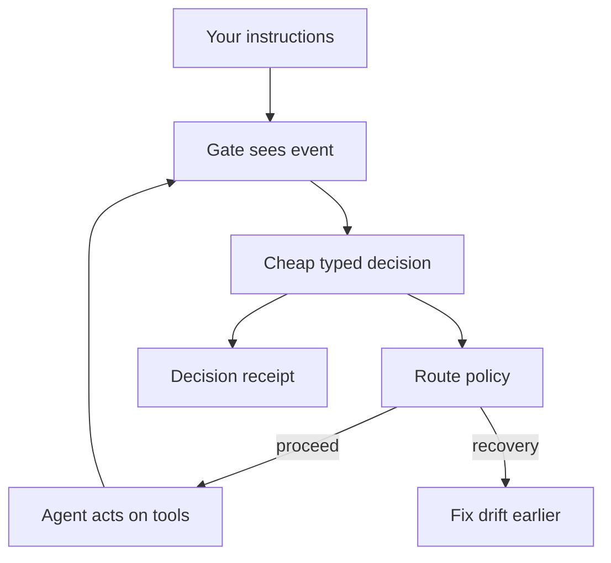

# Agent Custom Setup


> **Jev routing: cheap decision gates that help coding agents catch their own mistakes earlier — before they ship.**

## Why this exists

You give an agent a real brief: hosted API only, keys live at one path, don't touch that table. For the first hour it obeys. Then context compacts, a subagent paraphrases, and the agent proposes a self-hosted build against a key path that doesn't exist — confidently, mid-task, on something you thought was on track. You usually find out much later: a failed deploy, a wrong turn, or an "impossible" you shouldn't have accepted.

The expensive part of agent work isn't typing anymore. **It's drift you catch late.** Jev routing is this repo's answer: small decision gates placed at the moments drift first becomes visible — your prompt, the agent's claims, the tool call it's about to make, the advice it's about to act on. A gate doesn't stop the world when it sees something; it recommends a recovery route:

- `reconfirm_intent` — go back and re-check what the user actually asked;
- `rethink_plan` — the plan conflicts with a pinned instruction;
- `research_more` — the claim needs a source before action;
- `dispatch_verifier` — check this named claim against its source;
- `escalate` — a human should decide;
- `proceed` — covered, consistent, clear to go.

**A real failure built one of these gates.** In a voice-lab session, the brief said hosted API; after compaction the agent planned a self-hosted build, missed the free model, and reached for the wrong key path. That transcript became the Fish fixtures in [`jev-gate-pin`](modules/coordination/jev-gate-pin/v0.1.0/README.md): the tool gate must answer `deny` on the bad proposal, and the test suite requires zero missed blocks across the fixture set.

## What this project is

**agent-custom-setup** (ACS) is the registry and workshop for the Jev routing architecture: versioned, installable decision gates for coding agents (Claude Code, Kilo, oh-my-pi), the coordination pack that carries them into other repos, and the receipts that record what each lane actually did.

It is for operators who want **agents that flag their own drift while there's still time**, maintainers wiring several agents onto one repository, and authors benchmarking cheap decision lanes against real transcripts.

It is *not* a hosted platform — one lane calls a third-party decisions API (TypeSafe Jev 1.13 on OpenRouter), priced and governed by that provider, while the primary local lane runs on CPU. It is *not* an accuracy guarantee — the local benchmark lane so far reports discovery-only numbers, and the blind replay that would measure catch rate is open work ([issue #28](https://github.com/Pukujan/agent-custom-setup/issues/28)). And it is *not* a secrets vault: keys, tokens, and `.env` values never enter this repository; only environment-variable names are referenced.

**Status at a glance (as of 2026-09-29):** gates, shared ops database, court extension, and pilot receipts are on `main`; delivery stays PR-only with required checks; policy lives in [`POLICY.md`](POLICY.md) and the live index in [`registry.json`](registry.json).

## What you can make or use

- **Three decision gates** (optional drafts, opt-in): [`jev-ambiguity-gate`](modules/coordination/jev-ambiguity-gate/v0.1.0/README.md) scores prompt/resume clarity (`clear` / `ambiguous` / `insufficient`); [`jev-research-gate`](modules/coordination/jev-research-gate/v0.1.0/README.md) asks whether a claim needs research first (`yes` / `no` / `insufficient`); [`jev-gate-pin`](modules/coordination/jev-gate-pin/v0.1.0/README.md) vets proposed tool actions against pinned constraints (`allow` / `deny` / `escalate`).
- **An advisor court for oh-my-pi**: [`jev-court` v2 + loop-guard](oh-my-pi/README.md) adjudicates advisory notes with the same decision lane, budgets and suppresses the interruptions, and marks replayed background results so sessions actually finish.
- **A local benchmark lane**: the [Laya typed-decisions runner](modules/coordination/jev-oss-compare/v0.1.0/README.md) scores recovery-route recommendations on real session transcripts on plain CPU, with pinned model revisions and machine-readable receipts under `reports/runs/`.
- **A hosted comparison lane**: [`jev-shared`](modules/coordination/jev-shared/v0.1.0/README.md) wires the third-party `typesafe/jev-1.13` decisions API for live judging — off by default, never called in CI.
- **Multi-agent coordination**: the [hotload pack](modules/coordination/multi-agent-hotload/v0.1.0/HOTLOAD.md) installs join-order roles, a 30-minute boss lease, a GitHub claim queue, and an agent-less watchdog into a working repo.
- **One durable ops record**: [`ops-db`](modules/coordination/ops-db/v0.1.0/README.md) and [`session-ops-capture`](modules/coordination/session-ops-capture/v0.1.0/README.md) keep gate events, transcripts, and snapshots in a single local SQLite — git and GitHub issues stay the lasting proof.
- **A no-secrets launcher pattern**: InferHub Claude Code (LiteLLM) @ `0.2.0` under [`modules/claude-code/`](modules/claude-code/inferhub-litellm/v0.2.0/), keys by variable name only.

## How it works

**Every checkpoint is one small question, not a model dump.** The gate packs a tiny package — pinned constraints, the correction history, the proposed action, under a fixed character cap — and asks a cheap judge for a typed decision. Route policy is deterministic on top: incomplete or contradictory coverage can *never* silently become `proceed`; a durable intent conflict routes to `rethink_plan`; an explicit acknowledgment the response skipped routes to `reconfirm_intent`; unmatched sources route to `dispatch_verifier` or `escalate`.

<details>
<summary>Gate → decision → route (diagram)</summary>



Plain-language path: your instructions and the agent's actions enter a gate → the gate gets a cheap typed decision → a deterministic route policy emits proceed or a recovery route → recovery fixes drift earlier → every decision leaves a receipt.

</details>

Three rules keep the lanes honest:

1. **The judge recommends; it does not command.** Gates are advisory seatbelts — the boss/human keeps authority, and an abstention (`insufficient`) falls back to the mechanical checklist, never to silence.
2. **Fail quiet, never loud.** A downed court injects nothing; a misconfigured live judge escalates instead of guessing; budgets cap how often anything can interrupt.
3. **Decisions leave receipts.** Gate events append to the shared `ops.sqlite`; benchmark runs land as pinned, content-free JSON receipts so a future reader can re-check what was and wasn't measured.

The local lane on CPU is genuinely slow (the pilot's worst batch was ~18 seconds) — it earns its keep as the *cheap, private, reproducible* comparator against the hosted lane, which answers in hundreds of milliseconds at a fraction of a cent per decision.

## Evidence and boundaries

Statuses recorded 2026-09-29 against `main` (`8c62ba1`); live issues and PRs own progression.

| Claim | Status | Supports | Limits | Source |
|---|---|---|---|---|
| Three gates + shared decision client are registered installable modules | shipped (draft, opt-in) | Module trees, fixtures, mock-judge tests on `main`; zero missed blocks required on the Fish set | No measured catch rate yet; not binding in hotload load-order until proven in practice | [`registry.json`](registry.json) · [`jev-gate-pin tests`](modules/coordination/jev-gate-pin/v0.1.0/README.md) |
| jev-court v2 + loop-guard stop the advisory storm | shipped (opt-in, default off) | Replay of the real 94-note #35 fixture under mocked harness surfaces: 38/38 assertions, v1's 83 injections → 0; clean load in installed omp | Upstream async-result *wake* is harness-owned; needs a fresh-live-session confirmation receipt | [`oh-my-pi/README.md`](oh-my-pi/README.md) |
| Local Laya lane scores typed recovery decisions end-to-end on CPU | experimentally supported (discovery-only) | Capped local pilot: 805/805 planned jobs scored (7 of 80 streams); 13/13 adapter suite; 24-case mutation-proven metamorphic suite | **Not a catch rate** — non-blind pilot on a truncated export; checkpoint confidence is uncalibrated (reported ECE 0.213); the full blind replay is gated on corpus-host access | [`laya-pilot receipt`](modules/coordination/jev-oss-compare/v0.1.0/reports/runs/laya-pilot-20260929.json) · [#28](https://github.com/Pukujan/agent-custom-setup/issues/28) |
| Hosted lane gives fast typed decisions at low token cost | available (third-party API) | Provider lists `typesafe/jev-1.13` as a text→decisions model at $0.042/M prompt tokens, no completion charge | Third-party pricing/availability can change without notice; never exercised in CI; ACS only pins the client | [OpenRouter endpoint record](https://openrouter.ai/api/v1/models/typesafe/jev-1.13/endpoints) |
| ACS is source of truth; PR-only delivery; no secrets in git | shipped (policy) | `POLICY.md` authority + secrets rules; registry temporal metadata; branch protection with required checks is live | Policy text is not a runtime enforcer; enforcement quality is tracked in [#5](https://github.com/Pukujan/agent-custom-setup/issues/5) | [`POLICY.md`](POLICY.md) · [`registry.json`](registry.json) |
| Session ops capture (Pass 1 + Pass 2) | in review | Adapters, canonical rows, and tests exist on the open PR | Not merged to `main` as of this record | [#23](https://github.com/Pukujan/agent-custom-setup/pull/23) |

**Boundaries:** no API keys, tokens, cookies, or `.env` contents land here — ever; do not force-push shared branches; the gates stay advisory until evidence says otherwise; and where the receipts say "discovery-only," treat every number as scope, not score.

## Try it

Clone and cold-start the way a fresh session should — policy first, then the smallest working gate:

```bash
git clone https://github.com/Pukujan/agent-custom-setup
cd agent-custom-setup
# read POLICY.md → registry.json → checkpoints/CURRENT.md

# the Fish case in one command: hosted-only brief, self-host proposal -> deny
python modules/coordination/jev-gate-pin/v0.1.0/scripts/gate.py --fixture modules/coordination/jev-gate-pin/v0.1.0/fixtures/fish_hosted_vs_selfhost/block_selfhost_despite_hosted_brief.json --judge mock --json

# prove the fixtures and gate tests (mock judge; no paid calls)
python -m pytest modules/coordination/jev-ambiguity-gate/v0.1.0/tests modules/coordination/jev-research-gate/v0.1.0/tests modules/coordination/jev-gate-pin/v0.1.0/tests -q
```

Want live decisions? Point [`jev-shared`](modules/coordination/jev-shared/v0.1.0/README.md) at the third-party OpenRouter lane with `ACS_JEV_LIVE=1` and a key **name** resolved from an env file outside this repo. Wiring several agents onto your own repo? Start at [`HOTLOAD.md`](modules/coordination/multi-agent-hotload/v0.1.0/HOTLOAD.md) — install is complete only when all three stacks validate.

<!-- continuity:task-anchor ACS — product story above; policy in POLICY.md / AGENTS.md; live status on issues #28 #23 #5 -->
