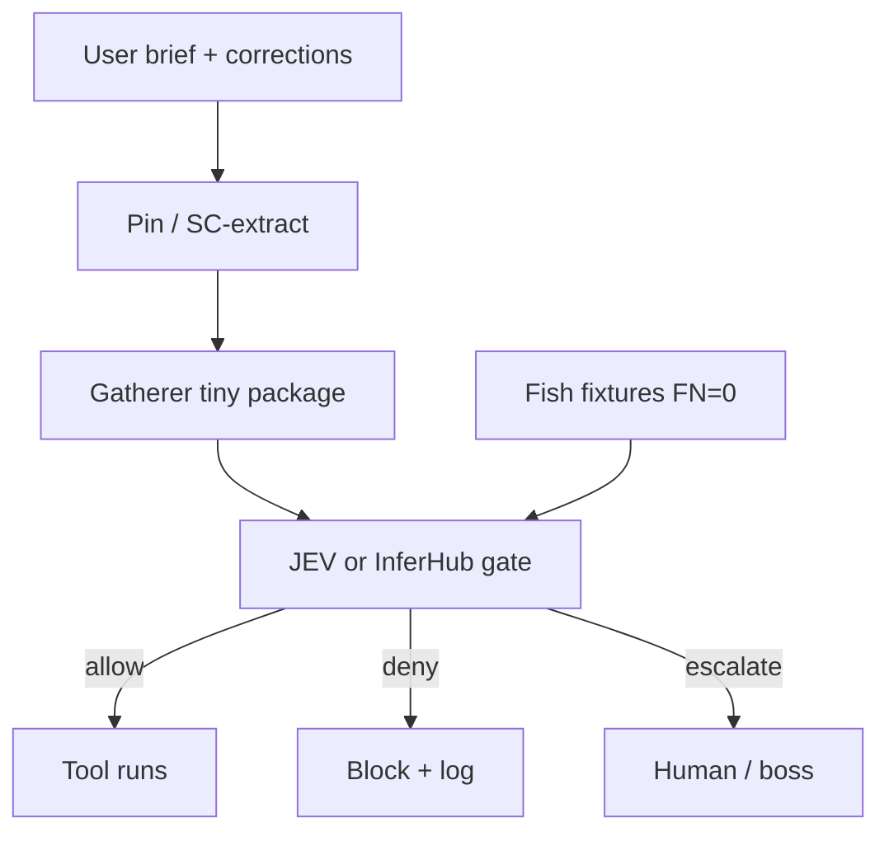

# ACS JEV architecture decision — gate + pin/compaction + Fish fixtures

## Summary

Optional ACS hotload module to stop Claude coding runs from dropping user constraints after long context / compaction. Extract and **pin** session constraints, build a **tiny gatherer package** (not the full repo), run a **JEV (or cheap InferHub judge) gate** before tools execute (allow / deny / escalate), bench with **Fish-style labeled fixtures** targeting **FN=0 on block**, and **log** gate events for ops. Lexical / BM25 prefilters come later to skip obvious cases.

This pack records the **architecture decision**. It is not an implementation module and does not register a runnable setup in `registry.json`.

## Motivating failure

Fish voice-lab Claude transcript: user constraints (Fish Audio **hosted vs self-host**, **key path**, **free model**) were missed especially after long context / compaction. Decision cites ~**17% session-constraint retention** under COMPINT / Lost in Compaction, and Governance Decay / Constraint Pinning as framing.

## Architecture (decided)

Optional ACS hotload module with five pieces:

1. **Pin / SC-extract** — Extract user constraints (session constraints) and **reinject** them across compaction boundaries so they survive context loss.
2. **Gatherer script** — Build a **tiny package** = user brief + corrections + proposed tool (not the full repository).
3. **JEV / InferHub gate (before tool runs)** — Judge with JEV, or a cheap InferHub judge, **before** the tool executes. Outcomes: **allow** / **deny** / **escalate**.
4. **Fish-style labeled fixtures** — Bench the gate with labeled fixtures; acceptance target **FN = 0 on block** (must not allow when the fixture says block).
5. **Gate event logging** — Log gate decisions for ops. Later: lexical / BM25 filters to skip obvious allow/deny cases without a full judge call.

Adjacent text (render-safe):

1. Pin constraints across compaction.
2. Gatherer builds tiny package (brief + corrections + proposed tool).
3. Gate judges before tool run → allow / deny / escalate.
4. Fish fixtures require FN=0 on block.
5. Log every gate event; add lexical/BM25 later.

## Roles and constraints (binding for this design)

| Role | Duty | Must not |
| --- | --- | --- |
| **Claude** | Codes / implements | Decide gate outcomes |
| **JEV** (or cheap InferHub judge) | Decides allow / deny / escalate | Replace coding |
| **Ultrafast** | Browser only | Act as researcher |
| **Docs + checklist** | Mechanical research paperwork | Substitute for the gate |

Research paperwork remains mechanical (docs + checklist); see related research-gate work (#13) and research paperwork track — gate design here does not replace that paperwork path.

## Non-goals (this pack)

- Shipping implementation code, scripts, or a versioned `modules/.../vX.Y.Z/` runnable module in this PR.
- Registering the design in `registry.json` before an implementation module exists.
- Putting secrets, API keys, or `.env` contents anywhere in ACS.
- Making Ultrafast the researcher.
- Claiming desktop paths as source of truth (ACS git remains SoT per `POLICY.md`).

## Provenance

| Field | Value |
| --- | --- |
| Source of record | ACS agent-custom-setup chat, 2026-09-27 (Alex + ACS) |
| Decision date | 2026-09-27 |
| Motivating failure | Fish voice-lab Claude transcript (constraint drop after compaction) |
| Ingest | fossil-core knowledge-pack draft → ACS `docs/knowledge/` |
| Owning issue | https://github.com/Pukujan/agent-custom-setup/issues/15 |

## Citations

- arXiv **2608.11242** — COMPINT / Lost in Compaction lineage (session-constraint retention figure cited in decision).
- arXiv **2606.22528** — Governance Decay / Constraint Pinning lineage.
- **TypeSafe Jev / jev-use gate** — prior gate pattern reference.
- **LangChain harness with Jev** — harness-integration reference.

*(Citation IDs recorded as named in the decision session; verify permalinks when implementing.)*

## Follow-on work (not this pack)

1. Optional: versioned hotload module under `modules/...` implementing pin + gatherer + gate + fixtures + logging.
2. Coordinate with #13 (binding external research gate) — complementary, not duplicate.
3. Wire Fish-style fixture suite with FN=0-on-block acceptance.
4. Ops log schema for gate events; later BM25/lexical short-circuit.

## Path convention note

ACS had no existing `docs/knowledge/` or `modules/knowledge/` tree when this pack was drafted. Chosen path: **`docs/knowledge/`** for durable architecture decisions that are not yet versioned runnable modules (`modules/<harness>/<id>/v<semver>/` remains reserved for implementable setups per `POLICY.md` / `registry.json`).
