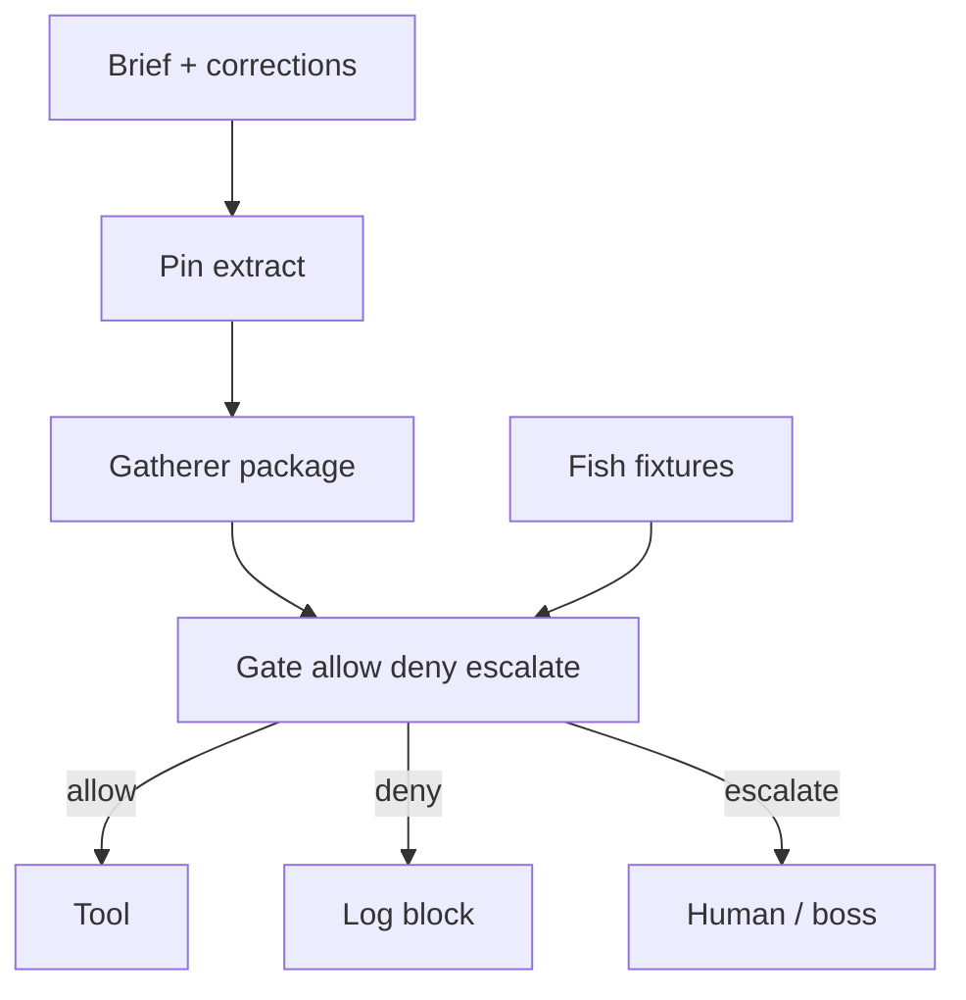

# jev-gate-pin v0.1.0 (optional draft)

Thin optional ACS module: **constraint pin** + **gatherer tiny package** + **PreToolUse-style gate** (allow / deny / escalate) + **Fish fixtures** (FN=0 on block) + compact event log.

**Status:** `draft`. **Optional until proven** — adopters may opt in; **not** forced into `multi-agent-hotload` `HOTLOAD.md` load-order until FN=0 is proven in practice.

Owning impl issue: [#17](https://github.com/Pukujan/agent-custom-setup/issues/17).

## Cite (architecture source of record)

| Field | Value |
| --- | --- |
| Knowledge pack | [`docs/knowledge/jev-architecture-gate-pin-compaction-fish.md`](../../../../docs/knowledge/jev-architecture-gate-pin-compaction-fish.md) |
| Architecture id | `acs-jev-architecture-gate-pin-compaction-fish` |
| Knowledge issue | [#15](https://github.com/Pukujan/agent-custom-setup/issues/15) |
| Knowledge PR | [#16](https://github.com/Pukujan/agent-custom-setup/pull/16) |
| Owning impl issue | [#17](https://github.com/Pukujan/agent-custom-setup/issues/17) |

Complementary to external research checklist [#13](https://github.com/Pukujan/agent-custom-setup/issues/13) / [#14](https://github.com/Pukujan/agent-custom-setup/pull/14) — this gate does **not** replace that paperwork.

## Five-part architecture

1. **Pin / SC-extract** — `scripts/pin_extract.py` heuristic pins (MUST / hosted / API / key path / model id) + capped reinject.
2. **Gatherer** — `scripts/gather.py` builds tiny JSON: pinned brief + corrections + proposed tool; default **8000 char** cap (never full-repo dump).
3. **Gate** — `scripts/gate.py` PreToolUse-style CLI → `allow` / `deny` / `escalate`. Default `--judge mock` for CI; `--judge inferhub` fails closed with escalate if not configured (no paid API calls unless env clearly set).
4. **Fish fixtures** — `fixtures/fish_hosted_vs_selfhost/` labeled allow/block; tests require **FN=0 on block**.
5. **Event log** — `scripts/log_event.py` appends compact JSONL; redacts secret-looking values.



Adjacent text (render-safe): pin → gather → gate → tool-or-block; fixtures score FN on block; Ultrafast stays browser-only.

## Roles

| Role | Duty | Must not |
| --- | --- | --- |
| **Claude** | Codes / implements | Decide gate outcomes |
| **JEV** (or cheap InferHub judge) | Decides allow / deny / escalate | Replace coding |
| **Ultrafast** | Browser only | Act as API researcher |
| **Docs + checklist (#13/#14)** | Mechanical research paperwork | Substitute for this gate |

## Non-goals (v0.1.0)

- Full live Claude Code PreToolUse production wiring (stub + docs OK)
- Always-on judge for every file read
- Lexical / BM25 short-circuit (later)
- Binding hotload load-order entry
- Calling paid InferHub/JEV APIs in CI
- Secrets / `.env` / keys in-repo

## Layout

```
modules/coordination/jev-gate-pin/v0.1.0/
  module.json
  README.md
  BEHAVIOR.md
  NOTES.md
  schema/gate_event.schema.json
  schema/gather_package.schema.json
  scripts/pin_extract.py
  scripts/gather.py
  scripts/gate.py
  scripts/log_event.py
  fixtures/fish_hosted_vs_selfhost/
  tests/
```

## How to run fixture tests

From repo root (pytest already used elsewhere in ACS):

```bash
python -m pytest modules/coordination/jev-gate-pin/v0.1.0/tests -q
```

Or unittest discovery:

```bash
python -m unittest discover -s modules/coordination/jev-gate-pin/v0.1.0/tests -v
```

Manual mock gate on a fixture:

```bash
python modules/coordination/jev-gate-pin/v0.1.0/scripts/gate.py \
  --fixture modules/coordination/jev-gate-pin/v0.1.0/fixtures/fish_hosted_vs_selfhost/block_selfhost_despite_hosted_brief.json \
  --judge mock --json
```

Expected: `"decision": "deny"` for the block fixture; `"allow"` for `allow_hosted_api_tool.json`.
