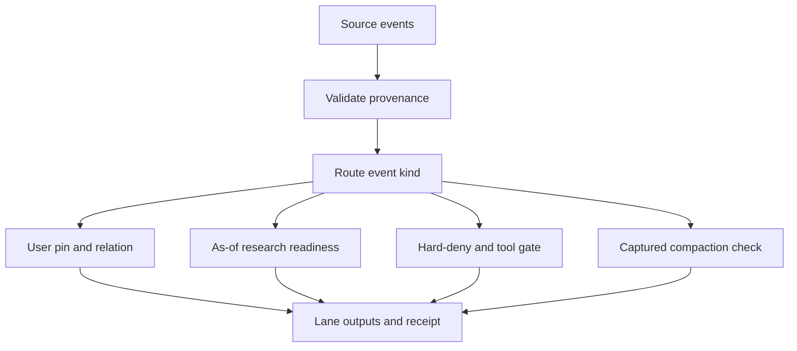

# PDD — Blind local decision-model replay

**Status:** proposed design for ACS-0004 / issue #28. It replaces the prior match-to-gold and peer-lane bakeoff objective for this replay. Jev and OpenRouter are prohibited in this experiment.

## Human problem

Coding agents have claimed that research was sufficient, started implementation, then lost time in loops because they had not inspected the relevant primary documentation or had dropped earlier user direction. Later messages can clarify, question, or take back earlier intent; tool use and context compaction can then act on an incorrect pin set. The user wants a mechanical replay that reveals whether local decision models naturally flag these failure patterns without telling the benchmark where the known examples are.

## Outcome

For each valid transcript stream, a deterministic runner advances one source event at a time and records independent decisions from Laya, OpenJev, and Kev lanes. It never executes historic tools. User-message relations and pin candidates run on every human turn; research readiness runs at eligible user/resume and coding boundaries; the hard-deny/tool gate runs on every tool call; compaction runs only where the source has a captured boundary. The result is an auditable discovery trace: what each lane surfaced and where it diverged.

## Observed symptoms and evidence

1. The former benchmark rewarded agreement with labels deliberately copied from the same known events the user wants detected naturally. That can measure label matching but cannot establish discovery of unknown failures.
2. The checked-in ACS 20-hour artifact is explicitly a fallback: its metadata says ReadTranscript was unavailable, users came from the old gold fixture, tool results are null. It is excluded from blind evidence.
3. The Claude harvest merges root and sidechain records, duplicates some IDs, truncates text, and omits causal/source-role fields needed to distinguish human intent from delegated agent prompts.
4. Raw Claude JSONL sources are available locally and include parent UUIDs, sidechain identity, tool results, and 41 `compact_boundary` records. A content-free parse found 18,350 normalized events across 80 streams: 14 root sessions and 66 child streams. It collapsed 2,210 repeated rows, found zero malformed rows, and linked 56 child streams to a unique parent; 10 child streams remain unresolved. A follow-up source-role audit found 46 `isMeta=true` user-role blocks, now kept as `meta_user` and excluded from human pin decisions. There are 198 eligible human-user events.
5. Current local model identities are verified: Laya typed-decisions on the PC, APUS OpenJev v1 4B Q4_K_M on the PC, APUS OpenJev v1 9B Q4_K_M on the MacBook Pro through the existing SSH forward, and Kev 0.8B on the PC. Each passed a synthetic local API smoke; none has received transcript text. The runner has not yet executed transcript inference.
6. A `jev-research-gate` prototype exists, but its live path calls OpenRouter/Jev on a claim snapshot and its mock is regex-based. It consumes a caller-supplied `known_docs` list; it does not reconstruct what official/versioned evidence the agent actually retrieved before each coding action, nor compare later failure evidence against those sources. The integrated local transcript research-evidence gate in this chart is therefore still missing.
7. The 41 raw compaction markers capture before/after token counts and retained message UUID lists (2–8 UUIDs each). The marker contains no compacted summary prose, so exact message retention is measurable but semantic survival of an omitted pin is not.

## Hypotheses

| Hypothesis | Status | Confirming experiment | Refuting result |
| --- | --- | --- | --- |
| H1: Pairwise history comparison finds useful message relations without gold examples | untested | Exhaustive per-stream comparisons with event IDs and fixed relation schema | Model produces only generic labels, misses relations, or cannot process a material fraction of messages |
| H2: A research gate can distinguish a coding claim from the evidence actually collected before it | untested | Rebuild an as-of evidence ledger from tool results/citations, then gate every eligible user/resume/coding boundary | Evidence extraction is too lossy to identify sources or model confidently approves absent evidence |
| H3: Pins give tool checks useful policy context | untested | Apply hard-deny first; compare each historic tool event with all active pin candidates without executing it | Context limits or retrieval omissions hide relevant pins, or lane outcomes do not expose conflict signals |
| H4: Native compact-boundary records can test retention behavior | partially supported | Compare source-preserved segments with active pin/evidence state immediately before and after each boundary | Boundary metadata does not reconstruct enough of the before/after context |
| H5: Local small models can run this workload with stable, inspectable output | untested | Exact `/v1/models` + health checks, single-request smoke, then fixed full replay | Endpoint unavailable, silent truncation, or output/schema failures |

## Counter-signal and caveats

- Existing Jev tests and historical lane results may be useful smoke evidence, but they do not answer whether these local models naturally catch unknown failures.
- A local decision model's confidence is model-specific. Laya uses entropy concentration for one confidence field; Kev and OpenJev use different normalization. Raw candidate distributions are retained, and thresholds are not shared across models.
- Successful replay cannot prove an agent would have recovered the actual task outcome. No gold means accuracy is intentionally unknown; agreement and event counts are descriptive only.
- Raw ACS/Grok transcript is not verified locally. The checked-in ACS artifact derives from gold-curated turns and tool stubs and is excluded. Four separate raw Claude roots are verified; a Claude-only run must be labeled accordingly.

## Scope and non-goals

- Input lanes: each source conversation/root is isolated; sidechains retain provenance and inherit only the parent pin/evidence snapshot available at delegation time.
- Gates: user-message ambiguity/relation + epistemic pin; research readiness from as-of sources; deterministic hard-deny then pin-aware tool decision; captured compaction boundary retention.
- Model roster: Laya; APUS OpenJev v1 4B on this PC; APUS OpenJev v1 9B on MacBook Pro; Kev 0.8B/4B/9B where the local host/runtime can support them. Exact checkpoint, quantization, and serving runtime are frozen per lane. The user-requested OpenJev 9B is pinned to the APUS family because its published collection has paired 4B/9B variants; an endpoint reporting another exact model is logged separately, never silently relabeled.
- Excluded: Jev, OpenRouter, external inference, curated/gold labels, failure-specific prompt cases, comparison with unrelated OSS agents, tool execution, production hook changes, and accuracy claims.

## Proposed flow

| Stage | Mechanical responsibility |
| --- | --- |
| Validate provenance | Deduplicate by UUID; distinguish human user text, delegated prompts, assistant claims, tool calls/results, and compact boundaries; resolve delegation only from source IDs and mark unresolved links incomplete. |
| User pairwise pin gate | Compare each human user turn against every earlier human turn in its own stream; chunk deterministically to model limits and receipt exact pair coverage. |
| As-of research gate | Reconstruct sources visible before the current coding boundary and decide `research_more`, `ready`, or `insufficient`; missing evidence never means `ready`. |
| Tool gate | Apply fixed hard-deny rules first; put every active pin into deterministic, context-bounded groups for each historic tool call; aggregate `allow`, `deny`, or `escalate`; diagnose non-allow groups pin by pin; do not execute tools. |
| Compaction gate | Evaluate only source-captured compact boundaries; compare pre-boundary active pins/evidence with preserved/post-boundary material. |
| Isolated model lanes | Keep per-model pin/evidence state separate so one model cannot coach another. |
| Replay receipt | Store source/config hashes, coverage, decisions, confidences, timings, and failure counts without transcript text. |

## Success and limits

Acceptance criteria are listed in `TASK-ACS-0004-blind-local-replay.md`. A clean Claude replay is a first usable result; the full two-source objective remains blocked until an actual, unlabelled ACS/Grok transcript is recovered. No percentage of agreement is called correctness without human labels, which remain outside this task.

## Lineage

- Leaf issue: [#28](https://github.com/Pukujan/agent-custom-setup/issues/28); parent: none declared; task: ACS-0004; related context: #25 and PR #26; dependencies: none for design.
- Primary writer: Codex; branch: `task/ACS-25-dual-jev-gates`.
- Owner scope correction: [#5867443649](https://github.com/Pukujan/agent-custom-setup/issues/28#issuecomment-5867443649). Data provenance correction: [#5867480911](https://github.com/Pukujan/agent-custom-setup/issues/28#issuecomment-5867480911).
