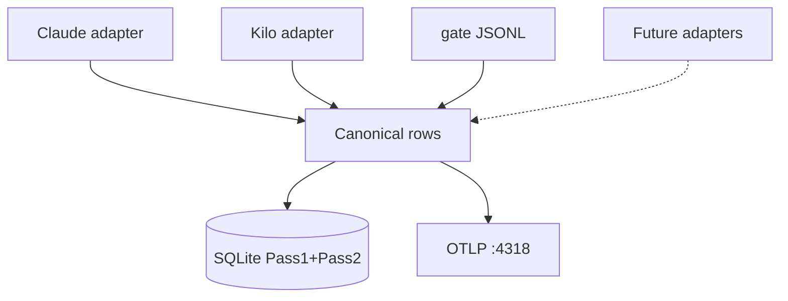

# session-ops-capture v0.1.0

ACS-wide ops capture for **any agent that hotloads ACS**: normalized
sessions/messages/tool_calls/gate_events → SQLite + OTLP (Pass1) + classify/embed
(Pass2). Claude Code JSONL is **adapter #1**; Kilo Code VS Code tasks are
**adapter #2**; Codex/Grok adapters are reserved extension points. Draft/optional (issue #22).

## Flow



## Quick start

```powershell
cd modules\coordination\session-ops-capture\v0.1.0
python -m pytest -q
python -m session_ops_capture `
  --jsonl tests\fixtures\synthetic_30_tools.jsonl `
  --db D:\claude\agent-runs\session-ops\probe.sqlite `
  --gate-jsonl tests\fixtures\sample_gate.jsonl `
  --adapter claude-jsonl --once
```

Default OTLP: `http://100.93.66.34:4318/v1/traces`  
Langfuse UI: `http://100.93.66.34:3000`

## Docs
[PDD.md](PDD.md) · [SDD.md](SDD.md) · [TDD.md](TDD.md) · [adapters/README.md](session_ops_capture/adapters/README.md)

## Status
`draft` / `optional`. **Not** bound into multi-agent-hotload `HOTLOAD.md` yet.


## Embeddings + JEV hot path (Alex lock 2026-09-28 / #25)

For already-working / super-fast decisions:

1. **Hot path** (ambiguity / research-needed / jev-gate-pin allow|deny|escalate) = **DETERMINISTIC only**.
   - **NO** embedding lookup
   - **NO** numpy
   - **NO** SQLite vector scan on the decision path
2. **Storage** = one shared `ops-db` SQLite; embeddings as **float32 BLOBs** on the embed stream (same FIFO family as parent stream).
3. **Similarity** = numpy exact scan over those BLOBs (or a warm cached matrix), **batched/offline only** — never on JEV hot path.
4. **No** Chroma / Pinecone / sqlite-vec unless corpus later demands it.

Lasting proof stays in **git + GitHub issues + benchmarks**. Ops DB is a FIFO buffer (per-partition), not a self-learning forever store.

