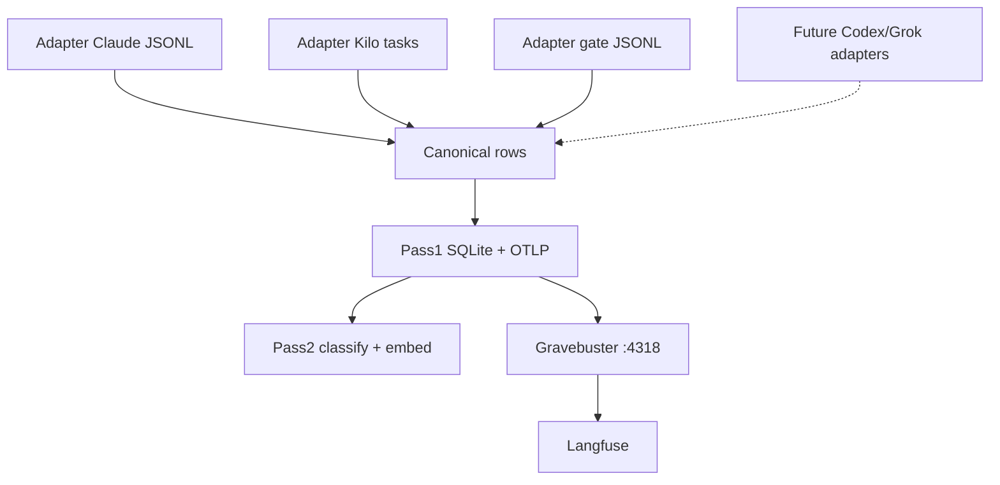

# SDD — session-ops-capture v0.1.0

## Architecture (ACS-wide)



## Adapter interface

`session_ops_capture/adapters/`:
- `TranscriptAdapter.ingest_path(path) -> AdapterResult`
- `AdapterResult`: `sessions`, `messages`, `tool_calls`, `gate_events`, `source`
- Registry: `claude-jsonl` (#1), `kilo-tasks` (#2 Kilo VS Code),
  `gate-jsonl`, reserved `codex-jsonl` / `grok-jsonl` / `generic-jsonl`
  (see adapters/README.md)
- Kilo paths: `%APPDATA%\\Code\\User\\globalStorage\\kilocode.kilo-code\\tasks\\<id>\\api_conversation_history.json`

Canonical sink does **not** fork per harness.

## Pass1 components
| Component | Role |
|-----------|------|
| `adapters/*` | Harness → canonical rows |
| `parse.py` | Claude JSONL + gate JSONL parsers used by adapters |
| `redact.py` | Secret scrub |
| `db.py` | SQLite + fingerprint |
| `otlp.py` | OTLP/HTTP JSON via stdlib urllib |
| `ingest.py` | CLI |

## Pass2 components
| Component | Role |
|-----------|------|
| `classify.py` | mock heuristics + optional `ACS_JEV_CLASSIFIER_URL` |
| `embed.py` | `HashingEmbedBackend` (default) + optional sentence-transformers |
| `pass2.py` | Batch classify+embed writer |

### Pass2 tables
- `classifications(uuid, entity_type, session_id, risk_class, research_needed, gate_relevant, labels_json, classify_judge, classify_rationale, classified_at)`
- `embeddings(uuid, entity_type, session_id, backend, dim, text_redacted, vector BLOB, embedded_at)`

## Proof / receipt package (scales)
Live evidence comments record: DB counts (incl. classifications/embeddings),
sample SQL, OTLP status, FN/FP on held-out plants, Langfuse UI base URL.
≥30 interactions = first slice; same schema for longer planted-miss sessions.

## CLI
```text
python -m session_ops_capture --jsonl PATH --db PATH [--adapter claude-jsonl]
  [--gate-jsonl PATH] [--once|--watch] [--no-otlp] [--no-pass2]
  [--live-classify] [--live-embed]
```

## Dependencies
Python 3.10+ stdlib. pytest for tests. Optional: `sentence-transformers` when
`--live-embed` / `ACS_EMBED_BACKEND=st`. No Langfuse keys in module code.
